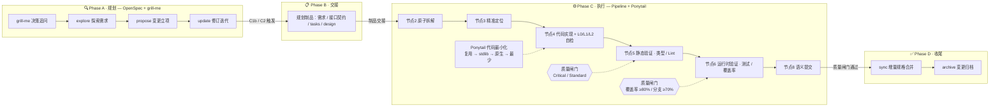

# auto-coding — AI变成助手

**🌐 语言 / Language：** [简体中文](README.md) · [English](README-EN.md)

[](LICENSE)
[](https://github.com/zhenkun26/auto-coding/releases)
[](https://github.com/zhenkun26/auto-coding/actions)
[](https://github.com/zhenkun26/auto-coding)

[](tests/)
[](pipeline/_contract_check.py)
[](openspec/)
[](plugins/auto-coding/.codex-plugin/plugin.json)

一套面向 AI 编码助手的并联开发体系：**grill-me(反思追问)+OpenSpec（业务规划）+ Pipeline（工程执行）+ Ponytail（代码最小化）** 各跑强项、互不重叠，按变更复杂度自动分流，并在作业过程中持续沉淀经验。

**auto-coding** 由本人在收集的优秀 skills 中，踩过很多坑后挑选的**优质组合**；是在和 AI 进行 vibe coding 过程中各种翻车后总结出的一套可行性经验（**特别是"开发到一半直接变垃圾"**）。在今天的 vibe coding 环境下，编程智能体开发过程仍然比较黑盒，而 **auto-coding** 能兜住智能体开发的下限。从一个想法到开发一半，再到平稳落地，总体比模型半路跑路实在强太多。

## 创作初衷

**vibe coding 的真正痛点，不是不会写代码，而是不知道"接下来该干什么"。**

刚开始和 AI 一起 vibe coding 时，我经常卡在同一个地方：

- **不知道如何探索**——想法很模糊，不知道该问什么、该调研什么，直接上手写；
- **不知道如何规划**——没有需求拆解，没有接口契约，改到一半才发现方向错了；
- **不知道如何运行**——写完代码不知道下一步该验证还是提交，全凭感觉；
- **不知道如何验收**——"看起来能跑"就算完成，类型、边界、覆盖、回归全凭运气。

结果就是：**开发到一半直接变垃圾**。AI 很努力，但没有流程兜底时，努力只会加速混乱。

后来我把踩过的坑沉淀成这套体系，让每个阶段都有明确的方法论兜底：

- 模糊想法 → **grill-me + OpenSpec explore** 负责探索与澄清；
- 变更规划 → **OpenSpec propose** 生成需求、接口契约与任务拆解；
- 工程执行 → **Pipeline**（节点 2→8）负责拆解、定位、实现、验证、提交；
- 代码质量 → **Ponytail** 逼你写最少、最简、够用的代码；
- 验收兜底 → **L0/L1/L2 三层自检** + 质量闸门，让"验收"可执行、可复现。

**这个仓库本身就是 dogfooding 的产物**——从产品化、加固到发布，全部是用这套体系自己迭代完成的。

## 架构



**关键设计**：

- **职责不重叠**：OpenSpec 只做规划（explore / propose / update），Pipeline 只做执行（节点2→8），不做重复的需求理解与任务拆解；
- **决策前置**：grill-me 在规划阶段独立运行——>2 个决策时 C1b 触发、>3 个决策时 C2 触发，逐分支追问直至达成共识；
- **全程兜底**：Ponytail 在节点4 全程驱动代码最小化，RUN_LOG / ERROR_MEMORY 持续沉淀；
- **闭环收口**：Phase D 的 sync 合并增量规格到主 specs、archive 归档变更，一次变更完整闭环。

## 组件职责

| 组件 | 职责 | 核心能力 |
|:---|:---|:---|
| **OpenSpec** | 业务规划 | `explore`（探索）、`propose`（变更创建+制品）、`update`（修订）、`sync`（增量规格管理）、`archive`（归档） |
| **Pipeline** | 工程执行 | 节点2（原子拆解）→ 节点3（精准定位）→ 节点4（实现+三层自检）→ 节点5/6（质量闸门）→ 节点8（规范提交） |
| **Ponytail** | 代码最小化 | 梯子框架（复用 → stdlib → native → 一行 → 最少）、过度工程审查、技术债追踪 |
| **grill-me** | 设计压力测试 | 逐分支追问方案直至达成共识，用于关键决策 |
| **adaptive** | 工具链自适应 | 根据项目已有工具决定验证策略，有配置无工具时中断提示，无配置时允许降级 |

## 目录结构

```
├── SKILL.md                  # 顶层技能：入口、分流规则、冲突裁决
├── LICENSE / THIRD_PARTY.md  # MIT 许可与第三方组件声明
├── CHANGELOG.md              # 版本记录
├── .agents/plugins/          # 仓库内 marketplace（分发入口）
├── .github/workflows/        # CI + Release 工作流
├── Dockerfile                # 生产级容器（88.9MB，validate/serve 双模式）
├── adaptive/                 # Pipeline 工具链自适应与不可降级底线
├── ai_pipeline/              # 运行产物与持续沉淀（RUN_LOG / ERROR_MEMORY / TECH_NOTES / VERIFY 等）
├── deploy/                   # Kubernetes 部署清单（Deployment/PDB/Service/Ingress/HPA）
├── docs/                     # 验收报告等文档
├── grill-me/                 # 设计压力测试技能
├── openspec/
│   └── skills/               # OpenSpec 各命令对应的技能实现（$openspec-explore / propose / apply / sync / archive / update）
├── pipeline/
│   ├── SKILL.md              # 6 阶段工程流水线总览
│   ├── CONFIG.md             # 默认阈值单一事实源
│   ├── _contract_check.py    # 自动化契约检查——仅 Python 模板（AST 解析；类型签名 + Gherkin 回退，命名空间感知）
│   ├── _session_state_schema.json  # SESSION_STATE.json 参考 schema，用于跨会话恢复
│   └── breakdown|locate|implement|verify|runtime_verify|commit|settle   # 各节点技能
├── ponytail_code/
│   └── exported-skills/      # ponytail full / audit / debt / gain / help / review 子技能
├── plugins/auto-coding/      # Codex plugin 包（plugin.json + 技能同步副本）
├── scripts/                  # 技能同步脚本等
├── self_verify/              # 代码落地三层自检协议（L0/L1/L2）
└── tests/                    # pytest 测试套件（36 用例，工具模块覆盖率 88%）
```

## 按复杂度分流

调用本技能时第一步判断复杂度，原则是「不值得做的事不做」：

| 等级 | 适用场景 | 路径 |
|:---|:---|:---|
| **C0** | 单文件/单函数变更（typo、小 bugfix） | 直接写代码 + Layer 0/1 自检 + 提交 |
| **C1a** | 小多文件变更（2-3 文件、单模块、无风险标记） | 1 份 `CHANGE_NOTES.md` 轻量规划 → 实现 → 测试 → Phase D-lite 契约同步 |
| **C1b** | 多文件/跨模块变更（4-10 文件，或含风险标记） | propose → 实现 → 测试 → 提交 |
| **C2** | 大型平台/子系统 | grill-me（>3 个决策时触发） → 完整链路 → 全部节点 + 全量沉淀 |

涉及 **FINANCE / AUTH / MIGRATION / STATE_MACHINE / EXTERNAL_API / ENV_OPS** 等风险或环境标记时，无论文件多少，最低升至 C1b，并执行对应的不可降级验证底线。

**代码库状态检测**：Pipeline 入口检查项目源码根目录是否存在已有源文件。无文件 → `[GREENFIELD]`：节点2/3 运行摘要模式（所有任务都是新文件，无需定位已有代码）。有文件 → `[BROWNFIELD]`：节点2/3 运行完整拆解和精准定位（MODIFY 任务需要精确插入点，REUSE 机会需要识别）。C0-C2 复杂度级别不变——greenfield/brownfield 只影响节点2/3 的报告深度。

## 工作流程

1. **Phase A — 规划**：OpenSpec 的 `explore` / `propose` 生成变更制品（需求、接口契约、tasks、design）；无 openspec 仓库时降级为 `ai_pipeline/PROJECT_SPEC.md` 单文件轻量规划。
2. **Phase B — 交接**：将规划制品交给 Pipeline 执行。
3. **Phase C — 执行**：节点2 原子拆解 → 节点3 精准定位 → 节点4 代码实现（Ponytail full + L0/L1/L2 三层自检）→ 节点5 静态验证 → 节点6 运行时验证 → 节点8 语义提交。
4. **Phase D — 收尾**：`sync` 将 delta 规格合并进主 specs，`archive` 归档变更。

断点恢复：再次调用时先读 `ai_pipeline/SESSION_STATE.json`（schema：`pipeline/_session_state_schema.json`）。若非空，入口步骤打印精确断点——哪个节点、哪个任务、哪个文件、第几轮自愈——并提示 resume 或 restart。节点4 在每个任务开始前和每轮自愈后更新 SESSION_STATE；节点5/6 在入口更新；节点8 完成时清空。这用显式的、数据驱动的状态追踪替代了隐式的 RUN_LOG 断点推断。

## 使用

```text
$openspec-explore <topic>                              # 探索需求
$openspec-propose <name>                               # 创建变更（tasks + specs + design）

「按三层流水线实现: openspec/changes/<name>/」          # 交接给 Pipeline 执行

$openspec-sync-specs <name> && git commit specs        # delta 合并到主 specs
$openspec-archive-change <name>                        # 归档变更
```

## 安装（Codex Plugin）

发布形态为 Codex plugin + marketplace，仓库内 marketplace 位于 `.agents/plugins/marketplace.json`。

**从 GitHub 安装**（仓库推送后）：

```bash
codex plugin marketplace add zhenkun26/auto-coding  # 添加本仓库为 marketplace
codex plugin add auto-coding@auto-coding         # 安装插件
```

**本地开发安装**：

```bash
codex plugin marketplace add /path/to/this/repo
codex plugin add auto-coding@auto-coding
```

**更新**：

```bash
codex plugin marketplace upgrade                 # 拉取 marketplace 最新快照
codex plugin remove auto-coding@auto-coding && codex plugin add auto-coding@auto-coding
```

**卸载**：

```bash
codex plugin remove auto-coding@auto-coding
codex plugin marketplace remove auto-coding
```

插件内技能由 `scripts/sync_plugin_skills.sh` 从仓库根同步（单一事实源）；修改技能内容后，发布前请重新运行该脚本。

## 快速开始

**1. 安装（首次）**

```bash
codex plugin marketplace add zhenkun26/auto-coding
codex plugin add auto-coding@auto-coding
```

**2. 探索并立项**

```text
$openspec-explore <你的想法>
$openspec-propose <change-name>
```

**3. 交接给 Pipeline 执行**

```text
"按三层流水线实现: openspec/changes/<change-name>/"
```

**4. 收尾（Phase D）**

```text
$openspec-sync-specs <change-name> && git commit specs
$openspec-archive-change <change-name>
```

从想法到提交约 5 分钟跑通；复杂度分流（C0-C2）与全部质量闸门由体系自动接管。

## 环境约束

技能包假定一个最小基线。缺失工具会触发引导安装提示或记录降级——不会静默失败。

| 依赖 | 必需？ | 角色 | 缺失时的降级 |
|:---|:---|:---|:---|
| **bash**（POSIX sh） | 必需 | Pipeline 命令、`printf` 追加快捷方式 | 无——bash 是执行环境 |
| **git** | 必需（节点8） | 语义提交 | `[SKIP_COMMIT: git unavailable]`——代码已写但未提交 |
| **openspec CLI** | 可选 | Phase A 规划、Phase D sync/archive | `[NO_OPENSPEC]` 模式——降级为 `ai_pipeline/PROJECT_SPEC.md` 单文件规划；Phase D 跳过 |
| **Python 3.10+** | 模板依赖 | `_contract_check.py`（AST 解析）、mypy、ruff、pytest | 非 Python 项目：契约检查降级为人工 L2 清单。Python 项目缺少 mypy/ruff/pytest：按 ADAPTIVE 规则处理（有配置→安装提示并中断，无配置→允许降级） |
| **mypy** | Python 模板 | 节点4/5 类型检查 | `[SKIP_TYPE_CHECK: no config]`——降级为 IDE 诊断 + AI 审查（仅当项目无 mypy 配置；有配置但未安装→安装提示并中断） |
| **ruff** | Python 模板 | 节点5 lint | `[SKIP_LINT: no config]`——降级为 AI 代码审查 |
| **pytest** | Python 模板 | 节点6 运行时验证 | `[SKIP_COVERAGE: no framework]`——降级为 Ponytail 自检 + 人工验收 |
| **TypeScript 工具链**（tsc/eslint/jest） | TS 模板 | 节点4/5/6 等价步骤 | 与 Python 工具相同的 ADAPTIVE 降级规则 |

**跨平台**：所有 pipeline 脚本使用 POSIX sh 语法（Windows 上通过 Git Bash 测试）。`_contract_check.py` 需要 Python 3.10+（AST `ast.unparse` 和 `match` 语句支持）。路径全程使用正斜杠。

## 质量保障

- **三层自检（L0/L1/L2）**：语法/导入 → 行为自检（assert/demo）→ 接口契约对照。
- **硬性闸门**：类型检查（Critical，失败中断+回滚）、lint（Standard，自愈 ≤3 轮）、运行时覆盖（默认行覆盖 ≥80%、分支 ≥70%）。
- **层级 mypy 检查点**（Node 4）：每完成一个拓扑层的任务后，对所有已写入文件运行全量 mypy——捕获逐文件检查遗漏的跨文件类型错误。错误必须在进入下一层前修复，绝不允许漏到 Node 5。
- **逃逸门检测**（Node 4→Node 5）：如果自愈通过 `Any`、`# type: ignore` 或 `cast()` 作为最后一轮保命手段，则视为逃逸——必须在 ERROR_MEMORY 中标记 `[ESCAPE_HATCH]`。Node 5 Critical 闸门扫描这些标记并提醒人工审查（不阻塞，但记录为质量债）。
- **持续沉淀**：每次作业即时追加 `RUN_LOG.md`（崩溃安全）、`ERROR_MEMORY.md`（跨运行错误记忆）、`TECH_NOTES.md`（ADR + 遗留问题）。`pipeline/SKILL.md` §0 中的 `printf` bash 一行命令提供原子化前置/追加操作，替代手工三步追加协议——无需 Python 环境。
- **自动化契约检查**（`pipeline/_contract_check.py`，仅 Python 模板）：从 spec 文件提取接口契约，通过 AST 与实际代码签名比对。支持两种解析模式：`PROJECT_SPEC.md` 风格的类型签名契约，以及 OpenSpec 格式的 Gherkin 端点提取（`WHEN POST /path`）作为回退。命名空间感知：类声明下的方法自动加 `ClassName.` 前缀（如 `TransactionService.authorize`），消除不同类中同名方法的误报。非 Python 项目使用 `self_verify/SELF_VERIFY.md` 中的人工 L2 契约对比清单。
- **冲突裁决**：需求存在性以 OpenSpec 为准、代码复用以 Ponytail 为准、spec 不完备时回滚并输出缺陷报告。
- **跨会话恢复**（`ai_pipeline/SESSION_STATE.json`）：追踪进行中的 pipeline 状态——当前节点、任务、文件、自愈轮次——跨会话保持。五个写入点（节点4 每任务+每自愈、节点5 入口、节点6 入口、节点8 清空）确保会话中断后，下一会话精确知道从哪里恢复。Schema：`pipeline/_session_state_schema.json`。
- **Greenfield/Brownfield 路由**：Pipeline 入口检测项目是否有已有源码，自动调整节点2/3 深度。Greenfield（无已有文件）→ 摘要 TASK_PLAN + 一行 LOCATE_MAP；Brownfield（已有代码库）→ 完整拆解，含精确行号、上下文代码块和冲突检查。
- **工具感知机制**（`[TOOL_CHECK]` 矩阵）：Pipeline 入口输出本次运行所有可用工具及其状态的矩阵。每个节点开始前引用此矩阵，确保工具（`_contract_check.py`、bash 追加快捷方式、层级 mypy）被主动使用而非被动记录。
- **风险标志重声明**（`[RISK_FLAGS_ACTIVE]`）：Phase A 声明的风险标志在 Pipeline 入口重新声明，并在每个标志相关检查前打印（节点4：FINANCE→Decimal 强制，节点5：AUTH→类型检查必须执行）。防止标志在 pipeline 中途被遗忘。
- **集成测试透明度**（Node 6）：覆盖率报告包含单元测试文件与集成测试文件的数量占比（通过 `test_api*.py` 命名或 `TestClient` 导入识别），不改阈值，仅提高透明度。
- **OpenSpec CLI 联调已验证**：Phase A→B→C→D 完整交接契约已通过项目根 mock OpenSpec 环境验证。四个检查点确认：Entry 检测 `openspec/config.yaml`、从 `openspec/changes/<name>/` 消费制品、Phase D delta→主 spec 合并、以及归档操作。所有沙箱同时支持 `[NO_OPENSPEC]` 降级模式。
- **自验证（随仓库）**：技能包自身按文档级 L0/L1/L2 协议验证，机械检查随仓库发布并在 CI 中运行：36 个 pytest 用例（工具模块行覆盖率 88%）、markdown 链接完整性检查、frontmatter license 扫描、中英 README 结构一致性检查（见 `.github/workflows/ci.yml`）。
- **历史验证记录（资产未随仓库发布）**：开发期曾运行 10 个测试套件（6 个沙箱：C0 计算器、C1b 认证、C1b API Key、C2 电商+折扣码、C2 金融结算、C2 库存管理；4 个本地套件：C0 工具函数、C1b 数据校验器、C1b 支付重试+熔断器、C2 任务执行引擎），共 148 个测试，覆盖全部 6 个风险标志、greenfield/brownfield 与增量修改。原始测试资产未随本仓库发布，当前不可复现；验证矩阵计划在后续版本随仓库重建。
